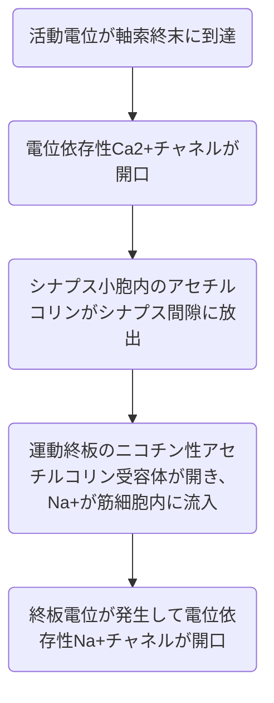

## 2024

```

(2) 神経筋接合部でニコチン性アセチルコリン受容体が開口して最初に骨格筋細胞で増加するものはどれか。

1. Na+

2. アセチルコリン

3. K+

4. Ca2+

5. 活動電位

```

  

> p14 神経筋接合部



アセチルコリンはニコチン性アセチルコリン受容体を開口させるものなので、Na+である。

```

(3) 筋の特性で正しいものはどれか。

1. 骨格筋・平滑筋・心筋では筋細胞の大きさが異なり、細胞内構造は同じである

2. 骨格筋と心筋は運動神経支配で随意筋に分類される

3. 平滑筋は神経伝達・ホルモンで収縮が変わる

4. 平滑筋は随意筋で自律神経によって調整される

5. 心筋は不随意筋で横紋筋に分類される

6. 骨格筋・平滑筋・心筋には収縮速度を調整するペースメーカー細胞が存在する

```

> p2 筋肉

- ATPの化学エネルギーによって収縮力を得る

- 種類の収縮フィラメントにより収縮->滑走する。

  - アクチンフィラメント

  - ミオシンフィラメント

- 細胞質Ca2+の濃度の上昇が収縮->滑走を引き起こす

  

> 骨格筋

- 随意筋(運動神経)

- 約400個存在、体重の40~45%

- 筋芽細胞が融合して発生するため、多核

- 数mm - 10cmほどの長さ、直径数十um

- 収縮フィラメントが詰まっている

- T細管と2つの終末層で三連構造、三つ組

> 平滑筋

- 一体型平滑筋と多単位型平滑筋が存在する

- 単核

- ねじれるように収縮

  

> p22 平滑筋収縮の特徴

- Ca2+濃度を上昇させるために以下の作用

  - 神経伝達物質

  - ホルモン

- 筋小胞体があまり発達しない

  

> 問題の分析

1 筋細胞の大きさも異なれば、細胞内構造も多核だったり単核だったりで異なるので誤り

2 心筋は不随意筋であるので誤り

3 収縮は変わるので正しい

4 平滑筋は不随意筋なので誤り

5 心筋は横紋筋かつ不随意筋であるので正しい。

6 ペースメーカー細胞は洞房結節で心臓の活動電位の発生に関係しているため誤り。

```

(4) 筋肉を 5Hz で刺激したときに単収縮する場合、不完全強縮を起こす可能性が最も大きい刺激頻度はどれか。

1. 1Hz

2. 5Hz

3. 10Hz

4. 25Hz

5. 100Hz

```

> p33

- 単収縮: 1回の刺激による収縮

- 加重: 適当な間隔で2回刺激すると収縮は重なる

- 強縮: 刺激頻度を増すと張力が加算され、プラトーに達する

- 不完全強縮: 刺激頻度が、強縮を起こす刺激よりやや少ないと収縮は動揺する

  

> 問題の分析

  

2 単収縮

3 加重

4 不完全強縮

5 強縮

  

```

(5) マラソン選手の大腿四頭筋の特徴として適切なものはどれか。

1. 赤筋が発達し、筋線維は細い

2. 白筋が発達し持久性に長けている

3. 遅筋が 55%、速筋 45%の比率で取り込まれている

4. ミオグロビン含有量の少ない遅筋の割合が多い

5. 単収縮振幅が大きく持続性のある筋肉である

```

> p34 速筋と遅筋

- 白筋: 速筋

  - 単収縮振幅が大きく、単収縮連発が少ない

  - ミオグロビン、ミトコンドリア、毛細血管など酸化能が低い

- 赤筋: 遅筋

  - 直径が小さい

  - ミオグロビン、ミトコンドリア、毛細血管など酸化能が高い

  - 単収縮振幅が少なく、単収縮連発が持続性

  

> 問題の分析

1 赤筋が発達している。筋繊維は細め

2 白筋は持久力ない。誤り

3 遅筋82%とかでめっちゃ遅筋寄り。誤り

4 ミオグロビンが多いから赤いんだよね。誤り

5 単収縮振幅が小さいから持続性はある。誤り

```

(6) 筋肉での ATP 合成の説明として誤っているものはどれか。

1. 嫌気的代謝の解糖系ではグリコーゲン 1 分子から ATP 3 分子を合成

2. クレアチンリン酸三分子の分解でATP 3分子の合成が可能

3. ATP 分解で生じたADPと無機リンから再び ATP を合成

4. TCA 回路ー電子伝達系は好気的代謝で ATP 合成量が多い

5. クレアチンリン酸分解は嫌気的代謝で筋肉特有の ATP 合成方法

```

> p12 筋肉のATP合成


- 解糖系

  - グリコーゲン1分子から3ATP

- TCA-回路・電子伝達系

  - グルコース1分子から30ATP

- クレアチンリン酸分解

  - クレアチンリン酸1分子からATP1分子

> 問題の分析

1 そう

2 そう

3 ATP合成はATP分解から生じた無機リンではなく、リン酸から。よって誤り。

4 多いね

5 そう

  

```

(7) 筋収縮の説明として正しいものはどれか。

1. 筋収縮の単位を Z 帯という

2. アクチンフィラメントがプラス側に引っ張られることで筋収縮が起きる

3. 収縮フィラメント同士が結合した状態から、ミオシン頭部がアクチンフィラメントから離れるまでの過程をクロマブリッジサイクルという

4. 全ての筋肉において収縮フィラメント、ATP、Ca2+が収縮に必須である

5. 平滑筋収縮は骨格筋収縮に比べてクロスブリッジサイクルが速く収縮力が小さい

```

> p4 骨格筋の構造


- A帯(暗帯): ミオシンフィラメントのみの領域と、両方のフィラメントが混在する領域を含む領域。

- I帯(明帯): アクチンフィラメントのみの領域でZ帯に付着する。Z帯は+端、H帯は-端と呼ぶ。

- H帯: A帯の中央領域で、ミオシンフィラメントのみ

- M線: H帯の中央にあってミオシンフィラメントを束ねる

- Z帯: αアクチニンが腫瘍構成タンパク質の帯。

> p8 骨格筋、平滑筋の筋収縮の比較

- ATPのエネルギーによって収縮力を得る。

- 2種類の収縮フィラメントにより収縮、滑走する

- 細胞質Ca2+の濃度の上昇が収縮を引き起こす。

- クロスブリッジサイクルが筋収縮を引き起こす。

> 平滑筋の骨格筋との差異

- 細胞質Ca2+濃度の上昇方法

- Ca2+の作用点

- 収縮期間と必要なエネルギー量

> 問題の分析

1 Z帯はミオシンフィラメントの接合部

2 ミオシンフィラメントがマイナス側に引っ張られることで筋収縮を起こすので誤り

3 クロスブリッジサイクルは離れてまたくっつく過程じゃない?

4 収縮フィラメントは必要だし、ATPも必要、Ca2+も必要なので正しい

5 p27 クロスブリッジサイクルが遅く、収縮力が大きい

```

(8) 筋弛緩過程の説明として適切なものはどれか。

1. 骨格筋ではミオシンフィラメントのトロポニンCに Ca2+が結合せず、クロスブリッジが形成されない

2. 骨格筋と平滑筋では細胞質内の Ca2+が筋小胞体に再貯蔵される

3. 平滑筋では Ca2+分解酵素によって細胞質内の Ca2+が分解され筋弛緩が始まる

4. 骨格筋と平滑筋ではクロスブリッジ阻害酵素によって筋弛緩が始まる

5. 骨格筋と平滑筋ではミオシン軽鎖ホスファターゼの活性化によりクロスブリッジ形成が阻害される

```

> p29 骨格筋の弛緩

- 骨格筋はCa2+ポンプによって細胞質Ca2+が筋小胞体に回収され、細胞質Ca2+濃度が低下することで弛緩する

> p30 平滑筋の弛緩

- ミオシンホスファターゼによりリン酸化ミオシンの減少、不活化ミオシンに

- CaM-Ca2+を分解して、Ca2+とCaMに

- Ca2+は筋小胞体に貯蔵、Na+Ca2+チャネル?で輸送、Ca2+ポンプで細胞外部へ

> 問題分析

  

1 ?不明すぎる。どこに書いてあるんだろう

2 これは正しい。

3 Ca2+が分解されるのではなく、Ca2+-CaMが分解される

4 クロスブリッジ阻害酵素ではなく、平滑筋は:ミオシンホスファターゼとか?[#neededcheck]

5 クロスブリッジ阻害?どこに書いてあった内容なのか[#neededcheck]

```

(9) 骨格筋における筋節の構造について適切なものはどれか。

1. M線からM線までが筋収縮の機能単位である

2. アクチンフィラメントとミオシンフィラメントは Z 帯に付着している

3. 明帯は太いフィラメントのみが存在している領域である

4. A帯の幅広いフィラメントのみの領域をI帯という

5. 筋節の中央領域は H 帯である

```

> 問題の分析

  

1 これはわからんけど、ZからZかも。

2 Z帯に付着しているのはアクチンフィラメントのみ

3 明帯=I帯のことで、アクチンフィラメントのみの領域のこと。アクチンフィラメントは細いので誤り。

4 いいえ、それはH帯。

5 筋節の中央領域はZ帯では?それともH帯かな?

**近接の中央帯はH帯とされる。覚えておこう**

```

(10) 筋収縮力の説明として誤っているものはどれか。

1. 筋肉の両端を固定し筋長を一定にした状態で刺激を加て、筋肉が収縮する力を機械で測定する方法等を等尺性収縮測定という

2. 重りをつけた筋肉に刺激を加えて、重りの持ち上がる速度で張力を測定することを等張性収縮測定という

3. 筋肉が物理的に戻ろうとする時の力を静止張力という

4. 筋肉が電位によって生理的に収縮しようとする力を発生張力という

5. 発生張力の最大値を静止長という

```

> p32 筋収縮力の測定

  

- 等張性収縮: 筋の一端におもりを吊り下げて刺激した際の筋長の変化

- 等尺性収縮: 筋の両端を固定して筋長さを一定にして刺激をしたときの張力

- 発生張力: 刺激が加わって、電位によって生理的に筋収縮しようとする力

- 静止張力: 電位によって生理的に筋収縮が起きるのではなく、物理的に戻ろうとする力

  

> 問題の分析

1 正しい

2 速度で張力を図るのではなく、等張性収縮は筋長の変化で測る

3 正しい

4 正しい

5 最大値を与える筋長であって、発生張力そのものではないのでは?

たぶん2だけど納得いってませんよ

```

(11) 以下文章中の1~5に適切な語句を入れよ。

骨格筋収縮は神経筋接合部で骨格筋細胞側に神経が伝わると ( ① ) が始まる。この過程は骨格筋細胞に ( ② ) が発生し、( ③ ) の ( ④ )にある受容体が脱分極を感知し、次いで筋小胞体の ( ⑤ )にある受 容体が開き口 Ca2+が放出することでクロスブリッジサイクルに入る流れである。

```

> p15 興奮収縮連関について

- 興奮収縮連関は、筋細胞の細胞膜に活動電位が生じ、筋の収縮が起こるまでの一連の過程

> 問題の分析

  

1 興奮収縮連関

2 活動電位

3 三連構造

4 T細管

5 終末槽[#neededcheck]

  

## 2023

```

(1) 筋肉が収縮するためにはアデノシン三リン酸 (ATP) が必要であり、筋肉では安定したATP 供給を実現するための複数の合成経路が存在する。その合成経路の名称を全 て答えよ。また、その中で筋肉のみの経路について、ATP が合成される流れを具体的な 物質名を含めて詳しく説明せよ。

```

> 問題の分析

解糖系

TCP回路-電子伝達系

クレアチンリン酸の分解

  

ATPが分解されるとADPとリンに分解される

クレアチンリン酸はクレアチンとリン酸に分解され、リン酸とADPからATPが合成される。

```

(2) 筋肉は、筋細胞に活動電位が伝わり、細胞質内Ca2+が上昇、アクチンフィラメントとミオシンフィラメントの相互作用が始まることで筋収縮が起きる。この一連の過程 において、細胞質内Ca2+が存在している条件下でフィラメント同士が結合した状態か ら、ATP の分解、筋節が収縮するまでの過程を特に何というか。英語で答えよ。

```

~~興奮収縮連関。名前は知らない。~~

cross-bridge cycle

```

(3) 平滑筋では、異なる酵素の働きによって収縮と弛緩が制御されている。平滑筋における筋収縮と筋弛緩に働く酵素をそれぞれ答えよ。

```

p30より、

収縮: ミオシン軽鎖キナーゼ

弛緩: ミオシン軽鎖ホスファターゼ

```

(4) 平滑筋収縮に使用される細胞質 Ca2+の供給には、細胞外由来と筋小胞体由来を 合わせて複数の経路がある。細胞外由来 Ca2+と筋小胞体由来 Ca2+がどのような経路で 取り込まれて収縮に利用される細胞質 Ca2+になるのか、その過程について各々1つ ずつ具体例を挙げながら詳しく説明しなさい。

```

具体例をあげるって何ｗｗｗｗｗｗ

障害者氏ね

細胞外液からCa2+がチャネルによって取り込まれる。その後、Ca2+はCaMと結合することで使われる形になる。

しらねーよｗ[#neededcheck]

## 2022

```

(1) 以下の文章は骨格筋収縮の過程を示している。A-H に当てはまる用語を答えなさい。

  

骨格筋の神経筋接合部では、( A )神経を伝わってきた活動電位が軸索終末で脱分極を引き起こす。それにより、軸索終末の ( B ) が開口し、その刺激によってシナプス小胞から ( C ) がシナプス間隙に放出される。神経筋接合部の骨格筋側は ( D ) と呼ばれ、 ( C ) が ( E ) に作用することで ( F ) が筋細胞内に流入する。これにより ( G ) が発生して、( H ) が開口する。

```

from p14

A: ~~末梢~~末梢

B: 電位依存性Ca2+チャネル

C: アセチルコリン

D: ~~終末槽~~運動終板

E: ニコチン性アセチルコリン受容体

F: ~~Ca2+~~Na+

G: 活動電位

H: 電位依存性Na+チャネル

```

(2) 下図は横紋筋の顕微鏡画像です。これについて、以下の設問に答えなさい。

```


  

```

(i) この筋肉は骨格筋と平滑筋のどちらを表していますか。

```

これは横紋筋なので、骨格筋である。

```

(ii) A帯、H帯、I帯、Z帯を解答用紙の図中に示しなさい。

```

  

```

(iii) この筋肉の収縮について、少なくとも以下の4つの用語を用いて説明しなさい。

ミオシンフィラメント、アクチンフィラメント、

プラス端 (+端)、筋節 (サルコメア)

```

ミオシンフィラメントが、アクチンフィラメントの接合先であるZ帯、+端に近づくことで筋節が短くなり、筋肉は収縮する。

```

(3) 骨格筋は主に手足・頭部の運動に関与し、瞬発的な筋収縮が特徴である。一方、平滑筋 は内臓の運動に関与しており、持続的な筋収縮が特徴である。

なぜ平滑筋では持続的な筋収縮が可能なのか、平滑筋の筋収縮の特徴について説明しなさい。

```

from p27

平滑筋は筋収縮1サイクルあたりの消費ATPが少なく、エネルギー消費が骨格筋に比べ少なく、クロスブリッジサイクルが遅く、収縮や弛緩の開始が遅くて結合状態にある時間を長く保てる一方、収縮力は骨格筋よりも大きいから。