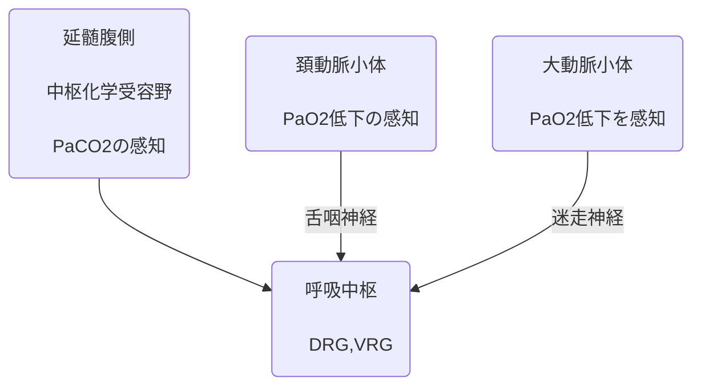
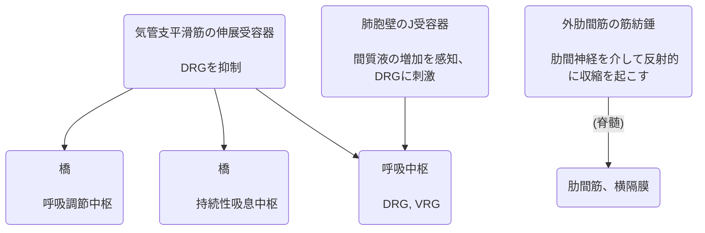

## 2024

```

1 吸息時に働く主要な筋はどれか?

a. 横隔膜

b. 大胸筋

c. 後斜角筋

d. 胸鎖乳突筋

e. 内肋間筋

```

> #4p3

- 呼吸筋は肋間筋と横隔膜である

> #4p4

- 深吸気: 胸鎖乳突筋・斜角筋

- 深呼気: 腹直筋・腹斜筋

> #4p5

- 吸気: 外肋間筋・内肋間筋の肋軟骨部

- 強制呼気: 内肋間筋

> 問題の分析

  

a 吸気

b 関係ない

c 後斜角筋は深吸気

d 胸鎖乳突筋は深吸気

e 内肋間筋は強制呼気

  
  

後斜角筋、胸鎖乳突筋はaccessoryなので主要な筋肉ではない

```

2 安静時の呼息で働くのはどれか?

a. 補助筋の弾性力

b. 肺の弾性力

c. 交感神経の活動

d. 横隔膜の収縮

e. 胸腔内圧の減少

```

> #4p3

休息時の呼気は受動的なプロセスであり、外肋間筋と横隔膜が脱力し、男性的な肺や胸壁は反動で入り込みます。

これは容量を減らし、胸腔内の圧力を増やします。

> #4p4

深い呼吸は、吸気筋の強力な収縮と追加の補助筋を、胸腔内の容積の大きな変化をもたらすために呼気、吸気両方において利用します。

> 問題の分析

  

a 補助筋は深い呼吸で使用される。

b 弾性力は呼息で使う

c ?不明

d 収縮は吸息

e 呼息は内圧が増加する

```

3 呼吸調節のメカニズムで正しいのはどれか?

a. 呼吸中枢は延髄に存在する。

b. 中枢化学受容野は大脳皮質に存在する。

c. 中枢化学受容野は PO2 センサーとして働く

d. 末梢化学受容器は延髄に存在する。

e. 肺伸展受容器刺激は呼吸運動を促進する。

```

> #4p14 呼吸の化学的調節



> #4p6 呼吸の機械的調節



  

> 問題の分析

  

a 呼吸中枢は延髄に存在するので正しい

b 中枢化学受容野も延髄に存在するので誤り

c 中枢化学受容野はPCO2センサーとして働くので誤り

d 末梢化学受容器は頚動脈小体と大動脈小体に存在するので誤り

e 肺伸展受容器: #4p6肺伸展受容器はDRGを抑制するので誤り

  

```

4 呼吸運動を促進する要因として正しいのはどれか?

a. 気道の拡張

b. 動脈血二酸化炭素分圧の上昇

c. 脳脊髄液の酸素分圧の上昇

d. 動脈血酸素分圧の上昇

e. 肺胞二酸化炭素分圧の低下

```

> 問題の分析

  

a 気道の拡張は気管支平滑筋の伸展受容器で、抑制されるので誤り

b 二酸化炭素分圧の上昇は呼吸促進要因として正しい。

c 脳脊髄液は二酸化炭素検知なので誤り

d 動脈血酸素分圧は逆なので誤り

e 肺胞の二酸化炭素分圧は直接の関係はないので誤り

```

5 呼吸運動の仕組みで間違っているのはどれか?

a. 呼吸は肺を取り囲む骨と筋肉によって作られた胸郭の動きによって起こる。

b. 吸気時には胸郭 (肺) が広がって空気を吸い込み、呼気時には胸郭 (肺) が収縮して空気を吐き出す。

c. 安静時には、呼吸は呼吸中枢の活動によって無意識のうちに行われるため、意識的には操れない。

d. 胸郭の拡大運動によって、胸腔内の圧力を変化させることで、肺胞が受動的に拡張・収縮して空気が出入りする。

e. 胸腔内圧は常に陰圧であるが、吸息時にはさらに陰圧へと変化することにより肺胞が拡張する。

```

a 正しい

b 正しい

c んー意識的に操れなくはないので誤り

d 正しい

e 更に陰圧で正しい。

```

6 肺胞気と動脈血の酸素分圧に差が生じるのはどれか?

a. 高地

b. 換気血流比不均等

c. 左-右シャント

d. 過換気症候群

e. 肺胞低換気

```

> #5p18 肺胞気・動脈血酸素分圧格差の要因 標準生理学第8版p690

- 低換気

- 肺胞・毛細血管間のガス拡散障害

- シャント

- 血流比の不均衡

> #5p19 呼吸不全病態の分類

- 低O2血症性呼吸不全: ガス交換障害

  - 換気血流比不均等

  - 拡散障害

  - 右-左シャント

- 高CO2血症性呼吸不全: 換気障害

  - 肺胞低換気

c 左-右シャントとは: #5p2

解剖学的シャント・真性シャント・右左シャント・左右シャント・生理学的シャント

> シャントには2つの大きな分類が存在:

- 右-左シャント: 静脈血が動脈側に混ざることで、PaO2が低下する

  - ファロー四徴症

  - エイスメンガー症候群

  - 肺動静脈瘻

- 左-右シャント: 動脈血が静脈側に混ざることで、右心負荷、血流増加を引き起こす

  - 心房中隔欠損

  - 心室中隔欠損

  - 動脈管開存

> シャントについての詳しい用語

- 解剖学的シャント・生理学的シャント: 正常でも存在するシャント

- 真性シャント: 換気されていない肺胞に血流が通過する現象

> 問題の分析

a 高地は書いてないから多分違う

b 換気血流比不均等これは正しい

c 左右は酸素分圧差を産まないので違う。生むのは右左シャント

d 過換気症候群はアシドーシスとかそのへんじゃないの

e 肺胞低換気はCO2の上昇であってO2の低下じゃないので誤り

```

7 二酸化炭素の感受性が最も高いものはどれか?

a. 大動脈小体

b. 頸動脈小体

c. 心房壁

d. 延髄腹側

e. 縦隔胸膜

```

> 問題の分析    

  

a 大動脈小体: PaO2低下を感知

b 頚動脈小体: PaO2低下の感知

d 延髄腹側中枢化学受容野: PaCO2の感知

```

8 末梢化学受容野の興奮と最も関係が高いものはどれか?

a. 動脈血酸素分圧の上昇

b. 静脈血酸素分圧の上昇

c. 動脈血二酸化炭素分圧の上昇

d. 動脈血重炭酸イオンの上昇

e. 動脈血酸素分圧の低下

```

動脈血の酸素分圧の低下と、動脈血の二酸化炭素分圧の上昇が関係する。

延髄は末梢とは言わないのかな。eで

```

9 ヘモグロビンが酸素を離しにくくなる状態はどれか?

a. 体温の上昇

b. 血液 pH の低下

c. 血中 2,3-BPG の増加

d. PaCO2 の低下

e. 血中水素イオンの上昇

```

> #3p20 ヘモグロビンのO2から離れやすくする要因

- 血液のCO2増加

- pH低下

- 体温上昇

> 問題の分析

a 逆に離れやすくなるので誤り

b 血液pHの低下も離れやすくなるので誤り

c 血中2,3-BPGはデオキシヘモグロビンの再酸素化を防ぐことで末梢組織での酸素放出量を増やす。ので誤り

d PaCO2低下は離れにくくなるので正しい

e 血中水素イオンが上昇するとpHが低下するので誤り

```

10 標準値(安静時)として、正しいのはどれか?

a. PaO2 は約 50 mmHg に維持されている。

b. PaCO2 は約 60 mmHg に維持されている。

c. 血液の pH は約 7.0 に維持されている。

d. PvCO2 は約 45 mmHg に維持されている。

e. PvO2 は約 20 mmHg に維持されている。

```

```

11 下図は肺胞構造の模式図を示す。

```


  

```

i. 図中の A~D の名称を答えなさい。

```

> #3p8 肺胞の微細構造

> #3p10

- I型肺胞上皮細胞

- II型肺胞上皮細胞

- 肺胞マクロファージ

- 線維芽細胞

> 問題の分析

A I型肺胞上皮細胞

B II型肺胞上皮細胞

C 層板小体: 表面活性物質を含んだ分泌顆粒で、開口分泌によって肺胞空に放出される

D 表面活性物質

```

ii. 物質 D は細胞が分泌し肺胞腔面を覆うように存在するが、もし物質 D がなくなると肺胞はどのように変化するか? その理由と共に答えなさい。

```

> #3p12表面活性物質の働き

- 表面活性物質は、リン脂質の親水性部分を水中に、疎水性部分を空中に向けて広がることで界面を形成し、肺胞の大きさを安定に保つ

- もしなかった場合、肺が縮んでしまう。

```

iii. 末梢組織から運ばれてくる CO2 はどのような機序で肺へ運ばれてくるか? 簡潔に説明しなさい。

```

> #3p22 CO2の運搬 標準生理学第8版p699 CO2運搬の形態

- 末梢組織で排出されたCO2は、末梢組織と動脈との分圧勾配によって毛細血管内に運ばれる。

- CO2は水和反応を起こしてH2CO3を形成する。

- CO2は赤血球との濃度勾配により赤血球内に拡散する

- 赤血球内の炭酸脱水酵素によってCO2の水和反応は促進される。H2CO3が生成される

- その後、HCO3-とH+に分離するが、HCO3-は血漿中のCl-と入れ替わる形で血漿中に拡散する。

- 肺胞内の空気と血漿中のCO2分圧差に従ってCO2は肺胞内に拡散する。

> #3p23 ボーア効果・ホールデン効果

- ボーア効果: pHが下がると酸素飽和度曲線が右方に移動するという効果で、CO2分圧が増加するとpHが低下し、酸素をより離しやすくする。

- ホールデン効果: 脱酸素化された血液のほうが、より多くのCO2と結合するという効果

> 割合

- HCO3-として: 70%

- カルバミノ化合物として: 20-25%

- 血漿中に溶解: 5-10

```

iv. O2 と CO2 のガス交換は、ある陽イオンを介して機能的に連関している。末梢組織で CO2 がヘモグロビンと結合した結果、この陽イオンがヘモグロビンから放出される。この陽イオンによる効率的な O2 の組織への供給機序を図示しつつ簡潔に説明しなさい。

```

H+によって媒介される。解説を参照[#neededcheck]

## 2023

```

金大医学類 2 年生の M 君は、無謀にも白山 (標高 2,702 m) 山頂からのバックカントリース キーに挑戦した。M君に既往歴は無く、健康状態は良好だったが、山頂付近で急に低酸素 血症の症状を呈したため、あえなく即下山となった。

なお、この物語はフィクションである。

```

  

```

1 白山山頂の気圧は約 738 hPa (554 mmHg) である。では、山頂での M 君の肺胞気酸素分圧はいくらか? 以下の肺胞気式を使って計算しなさい。なお、PaCO2は標 準値とし、山頂における水蒸気圧は 47 mmHg とする。

PAO2 = PiO2 - PaCO2 / R (R: 呼吸商)

また、M君の山頂での PAO2 は理想的にはおおよそいくらかと考えられるか?

```

> #3p4 内呼吸と外呼吸 #5p18 AaDO2

- PA: 肺胞気: PAO2 = PIO2 - PaCO2 / R(呼吸商)

- PI: 吸気 : (気圧-水蒸気圧) * 気体の割合(酸素0.21, 二酸化炭素0.0004)

- PE: 呼気

- PV: 静脈血

- Pa: 動脈血

- P: 末梢組織の細胞

- 呼吸商R: 産生されたCO2 / 消費されたO2のことで、栄養素の種類によるが、平均してR=0.8の値を利用する。[#neededcheck 数値の記憶]

- PaCO2: 40mmHg

- AaDO2: 正常時10mmHg

| 基質       | R値 |

| :--------- | :-- |

| 炭水化物   | 1.0 |

| 脂質       | 0.7 |

| タンパク質 | 0.8 |

> 問題の分析

PAO2= PiO2 - PaCO2/R

    = (554mmHg - 47mmHg) * 0.21 - 40mmHg / 0.8

    = 507mmHg * 0.21 - 50mmHg

    = 106mmHg - 50mmHg = 56mmHg

PaO2= PAO2 - AaDO2 = 56 - 10 = 46mmHg

```

2 頂上での M 君の呼吸はどのように変化すると考えられるか? 予想される変化が 生じる理由を簡潔に説明せよ。その際、化学受容器の場所・名称、呼吸中枢の場 所と呼吸筋の名称に留意して答えなさい。

```

化学受容器:

- 延髄腹側: CO2の上昇

- 大動脈小体: O2の減少

- 頚動脈小体: O2の減少

> 問題の分析

呼吸が増加する

今回はPaCO2は上昇していないが、PaO2は減少していると考えられる。

よって頚動脈小体が反応する。呼吸中枢に連絡。

呼吸中枢は延髄背側に存在する

呼吸筋は横隔膜や肋間筋

  

```

3 低酸素血症を伴う M 君の体内では、嫌気的解糖系中間体 2,3-ビスホスホグリセリン酸 (2,3-BPG) の合成が刺激されると考えられる。この結果、M 君のヘモグロビ ンの酸素解離曲線はどのように変化すると考えられるか? 酸素解離曲線グラフで図示し(縦軸・横軸の単位と数値も)、答えなさい。また、この変化は生理学的 に考え、高所での有用な順序であると思われる。その理由を述べなさい。

```

ヘモグロビンの酸素解離曲線は右に移動する。

この変化は、2,3-BMGのデオキシヘモグロビンとO2の再結合を防ぎ、末梢組織での酸素放出量を増加させる点で有用であり、これは高所では酸素を体内に供給することで低酸素に伴う症状を抑制することにつながる点で有用である。[#neededcheck 具体的な数値]

```

4 頂上での M 君の AaDO2 が、25 mmHg だったと仮定した場合、M君の症状の予測 される発症原因 3 つを挙げなさい。

```

AaDO2が10を超えていることは肺胞内の酸素分圧に対して動脈血内の酸素分圧が小さすぎることがある。これは

- 右左シャント

- 換気血流比不均等

- 肺胞・血液での拡散障害

によるものである。

```

5 下山後、M 君は肺水腫と診断され、入院となった。上記 4) で答えた 3 つの原因の うち、最も可能性の高い原因を挙げ、その肺組織の状態と低酸素血症に至った理 由を簡潔に説明しなさい。

```

> #4p8 肺に関する病気

 肺・胸郭のコンプライアンスは拡がりやすさである。

 肺のJ受容器は肺の浮腫やうっ血と言った病的な状態を感知し、呼吸数の増加や浅い呼吸などを引き起こす受容体である。

- 肺高血圧

  1. 肺動脈圧の上昇

  2. より強い力で押し出すため、右室拡大「心臓リモデリング」

  3. 右心室が収縮力が弱くなり拡大したままになる

  4. 機能低下による右心不全。血液不足

- 肺水腫

  1. 間質の液体成分が増加することで間質のJ受容器が刺激される

  2. 過換気になる

  3. 重力の影響で下肺や背部に液体が多くたまり、コンプライアンスが低下して換気・血流費の不均等分布が著しくなる

  4. 酸素が毛細管血に至るまでの距離が増加し、低酸素血症にもなる

> 問題の分析

- 肺水腫に関連するのは~~換気・血流皮膚均等分布である~~ 拡散障害である。

- 肺水腫は下の方に水が溜まって浮腫になり、コンプライアンスが低下している状態である。**肺胞内に液体成分が貯留、あるいは間質に血漿成分が貯留**

- ~~低酸素血症になる理由は、酸素がもう採血に至るまでの距離が増加すること~~肺胞と肺毛細血管との間のガス交換が障害されること。

  

## 2022

```

(1) 成人ヘモグロビン (α2β2) の酸素解離曲線を正確に図示し (横軸・縦軸に名称・単位と数 値を入れること)、この曲線が意味する生理的意義を2つ挙げなさい。また、胎児のヘモグロビ ン (α2γ2) は酸素結合能が高いが、曲線はどのように変位するか? 同グラフ上 に点線で示しなさい。

```

[#neededcheck 成人ヘモグロビンの酸素解離曲線]

- 生理的意義: 肺胞のような酸素分圧が高い場所でヘモグロビンが酸素と結合し多少の分圧変化ではHbの酸素飽和度の低下が軽度。末梢組織のような酸素分圧の低い場所ではPbO2低下に対して急激に酸素飽和度が低下し、効率よく酸素を放出するということを示している。

- 胎児は酸素結合能がたかいため、左に変位する。

```

(2) 上記 (1) で答えた胎児ヘモグロビンとは逆に、激しい運動をした時の成人ヘモグロビンは 末梢組織でより酸素を放出する。この理由は何 か? (1) で図示した酸素解離曲線を使 い、簡潔に説明しなさい。

```

2,3-BMGが放出され、末梢で酸素を放出しやすくなるから。

右に変位

**二酸化炭素分圧が増え、pH低下や体温の上昇によるものでもある**

```

(3) 末梢組織で産生される CO2 の大部分は、次の化学反応が生じる。

```

  

```

CO2 + H2O ⇄ X ⇄ (陽イオン) + (陰イオン)

```

  

```

i) この陽イオンと陰イオンを答えなさい。ii) また、この陰イオンは、どのように肺まで移動し、 肺胞へ排出されるか簡潔に答えなさい。iii) 呼吸性アシドーシスの場 合、上記反応はどちらにシ フトするか?その結果、ある化学受容野がそれを感知するが、その場所とその後の調節機序を 簡潔に説明しなさい。

```

X: H2CO3

陽イオン: H+

陰イオン HCO3-

HCO3-は赤血球からCl-と入れ替わりで血漿中に拡散する。

そうして肺まで血中で運ばれたHCO3-は肺胞にて、CO2分圧の低さによってCO2となって拡散し、排出される。

呼吸性アシドーシスの場合、CO2側、つまり左側にシフトする。CO2の受容野は延髄腹側に存在し、それが呼吸中枢に連絡することで換気量が増える。

```

(4) 肺実質を構成する 2 種類の細胞で、肺胞構造を図示しなさい。この 2 つの細胞の名称、特 徴と役割を答えなさい。

```

肺実質はI型肺胞上皮細胞とII型肺胞上皮細胞である。

II型肺胞上皮細胞は**肺胞内に微せん毛を持ち**、層板小体という細胞小器官を持ち、それを肺胞内に放出することで表面活性物質サーファクタントを作り出す。肺胞腔の表面張力を下げることで肺胞が虚脱するのを防ぐ。I型肺胞上皮細胞は毛細血管と肺胞内との空気交換を行う。**(通しやすい)**

```

(5) どうやって空気が肺に入ったり、肺から出たりするのか? 次のキーワードの中から、適切 なものを選択し、換気の機序を簡潔に説明しなさい (図示しても構わない)。

```

  

```

キーワード:胸腔内圧、肺胞内圧、胸郭、横隔膜、陽圧、陰圧、肺胞、肺動脈、肋間筋、腹直筋、大気圧、 気胸、末梢化学受容野、中枢化学受容野、呼吸中枢、大脳皮質、ボイルの法則、マーフィーの法則

```

胸腔内圧は平常時、陰圧になっている。

吸気時、横隔膜は収縮、肋間筋による胸郭の拡大によって胸腔内圧が更に陰圧となる。その事によって肺胞内圧も下がり、肺胞が拡大することで空気が肺に入る。

呼気時、横隔膜が弛緩、肋間筋による胸郭の縮小によって胸腔内圧が上がる。その事によって肺胞内圧が上がり、肺胞が縮小することによって空気が肺から出る。

```

(6) もし仮に、あなたが新型コロナウイルスに感染し、肺炎と診断を受けたと する。動脈血液 ガスを測定した結果、PaO2=75、PaCO2=40 であった (発症前の PaO2 は 95mmHg で正常)。下 記の肺胞気式を参考に、AaDO2 を計算し、あなたの AaDO2 は「正常」か 「開大」どちらか判断 しなさい。また、AaDO2 が開大する要因3つを挙げなさい。

```

PAO2 = PiO2 - PaCO2 / R = (760 - 47) * 0.21 - 40 / 0.8 = 713 * 0.21 - 50 = 150 - 50 = 100

PAO2 - PaO2 = 25より開大

シャント

拡散障害

換気・血流皮膚均等分布

```

肺胞気式 PAO2 = PiO2 - PaCO2 / R (R = 呼吸商 = 消費される O2と産生される CO2 の比)

PiO2 = 呼気の酸素分圧、大気圧 = 760 mmHg、飽和水蒸気圧 (37°C) = 47 mmHg,

大気中の O2 の割合は 21%とする

```

## 2021

```

肺は呼吸によって酸素 (O2) を取り込み、二酸 化炭素 (CO2) を排出する。外界からの空気は肺 胞まで達し、そこでガス交換が行われる (右 図)。肺胞壁に存在する細胞種のうち、細胞 A か ら分泌される物質 X は、細胞 B からなる肺胞の 内腔を覆う。これらは肺胞構造および機能を 維持する上で非常に重要なことである。

```

  


  

```

1 細胞 A および B、物質 X の名称を答えなさい。また、「新型コロナウイルス (SARS-CoV-2) が細胞 A に感染すると、物質 X が産生できなくなる」という論文報 告があるが、この結果、肺胞はどのように変化すると考えられるか? 簡潔に答え なさい。

```

A: II型肺胞上皮細胞

B: I型肺胞上皮細胞

X: 表面活性物質(サーファクタント)

```

2 SARS-CoV-2 感染による重症肺炎の患者さんでは、SpO2 が 90%以下となり低酸素血 症を呈する。この際、呼吸数が増加し深い呼吸となる換気の亢進がみられるケースが多い。では、この換気亢進の機序を簡潔に説明しなさい (なお、化学受容器の 場所・名称、呼吸中枢の場所、呼吸筋の種類に留意すること)。

```

SpO2が減って、PaO2が減少すると、大動脈小体や頚動脈小体がそれを感知し、呼吸中枢に連絡する。呼吸中枢は延髄の背側に存在する。

呼吸中枢は横隔膜や肋間筋などに司令を送り、換気が亢進される。

```

3 上記の肺炎患者さんや過換気の状態において、酸塩基平衡はどのようになるか?

「一次性変化 a~e」と「病態 i~vi」の正しい組合せを選びなさい。

(回答例: c - iii)

  

〈一次性変化〉

a. pH7.31 で、HCO3- が 20 mEq/L

b. pH7.25 で、PaCO2 が 49 mmHg

c. pH7.40 で、HCO3- が 24 mEq/L

d. pH7.58 で、HCO3- が 38 mEq/L

e. pH7.60 で、PaCO2 が 22 mmHg

  

〈病態〉

i. 代謝性アルカローシス

ii. 呼吸性アルカローシス

iii. 高アニオンギャップ

iv. 代謝性アシドーシス

v. 呼吸性アシドーシス

```

過換気のとき、アルカローシスに値する。

呼吸性アルカローシスであり、これはPaCO2がめっちゃ下がることで分かるのでe-iiかなあ?[#neededcheck]

```

4 仮に上記の重篤肺炎患者さんの動脈血 PO2 が 58 mmHg の場合、「呼吸不全」と診断 される。この時の A-aDO2 はいくつになるか? 数値で答えなさい。

(ヒント: PAO2 = 150 (PiO2) - (PaCO2 / 0.8) )

```

PaO2 = 58

PAO2 = 150 - 22 / 0.8 = 150 - 22.5 = 150 - 22.5 = 122.5

PAO2 - PaO2 = 64.5

  

## 2020

```

金大医学類 2 年生の A さんは、昨年夏休みにスイス・アルプス最高峰「モンブラン (標 高 4810m)」登頂に挑んだ。登山口前は既往歴もなく、健康状態は良好だった (登山口の動 脈血 PO2 (海面レベル)は 95 mmHg であった)。しかし、頂上付近で A さんは、低酸素血 症の症状を呈してしまい、あえなく下山することとなった。

```

  

```

(1) マッターホルン山頂の気圧は約 430 mmHg である。では、山頂における大気中 の PO2 および肺胞気の PO2 はそれぞれいくらか? (なお、肺胞内の飽和水蒸気 圧 (37 °C) は 47 mmHg とする)

```

大気中: ( 430 - 47 ) * 0.21 = 383 * 0.21 = 80.43 mmHg

肺胞気: 80.43 mmHg - 50 mmHg = 30.43mmHg

```

(2) 頂上での A さんの呼吸はどのように変化したと考えられか? 予想される変化が 生じる理由を簡潔に説明せよ。その際、化学受容器の場所・名称、呼吸中枢の場 所と呼吸筋の名称に留意して答えなさい。また、A さんの動脈血二酸化炭素分圧 (PaCO2) はこの時、どのように変化するか? その理由と共に答えなさい。

```

呼吸が浅く、多くなった。換気亢進。

これは大動脈小体と頚動脈小体による延髄背側の呼吸中枢への連絡による。

呼吸中枢は呼吸筋の横隔膜と肋間筋に司令を送り、呼吸を行う。

PaCO2は下がる。呼吸が亢進されて拡散するため。

```

(3) (2) で答えた A さんの PaCO2 の変化の結果、血中 pH は正常値に比べ、どう変化 すると考えられるか? 動脈血 pH の正常値と共に答えなさい。

```

pHが正常値に比べて上がる。**呼吸性アルカローシス**

pHの正常値は知りません。[#neededcheck]**7.4+-0.05**

```

(4) 低酸素血症を伴う A さんの体内では、嫌気的解糖系中間体 “X” の合成が刺激 されると考えられる。この X の名称を答えなさい。この結果、A さんのヘモグロビン の酸素解離曲線はどのように変化すると考えられるか? 酸素解離曲線をグラフで図示し、答えなさい。また、この変化は生理学的に考え、高所での有用な順 応であると思われる。その理由を述べなさい。

```

~~乳酸~~ 2,3BPG

右側に移動する。そのことによって末梢部位への酸素供給が増える。

## 2021

2024と同一の問題

## 2018

- 動脈血酸素飽和度SaO2についてneededcheck

- 静脈血PvO2に付いて記憶

- P50

- AaO2はなんの略か。肺胞気・動脈血酸素分圧較差

- **換気血流比不均等**

## 2017

- 炭酸脱水酵素

- 70%: 血漿中のHCO3-

- 20%: カルバミノ化合物

- 10%: その他

4 2 5 6 3 1  

# 2016

# 2015

- I型細胞上皮細胞は核周囲にしか細胞小器官を持たず、細胞質のみの部分は薄い。また、血管内皮細胞との間に基底膜しか介さないため、気体交換を行いやすくなっている。